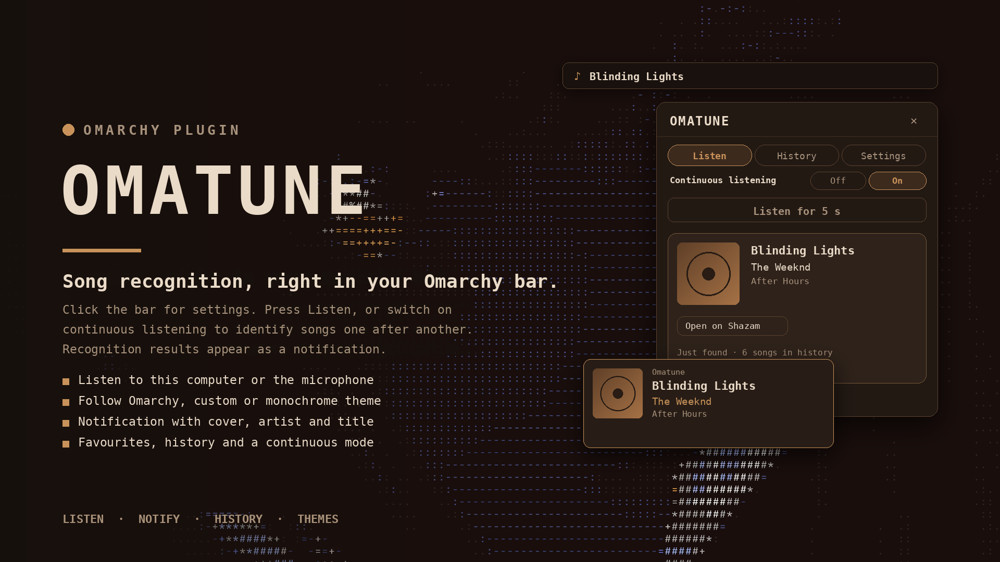

# Omatune

Song recognition in your [Omarchy](https://omarchy.org) bar. Click the icon, let it listen for a few seconds, and the song appears as a notification with its cover photo, artist and title, on the bar, and in your history.



## Features

- **Identify**: press **Listen** in the panel to record a few seconds (length is configurable). Or turn on **Continuous listening** to keep identifying songs one after another with no clicks.
- **Notifications**: the song title and artist, with the album cover as the picture. The cover is downloaded once and cached.
- **Listen to this computer or the microphone**: *This computer* records whatever is playing; *Microphone* listens to the room.
- **Themes**: *Follow Omarchy* uses your live Omarchy theme and updates the moment you switch it. *Custom* lets you choose the background, text and accent from a palette or a hex code. *Monochrome* is greyscale.
- **Bar**: the icon (changeable) and optionally the last song found.
- **History**: the most recent songs, newest first. Click one to open it on Shazam. Size is configurable.
- **Favourites**: save any song with **♡ Save** (on the last result) or **♡** (on a History row). The **♥ Favourites** filter in History shows only the saved songs. They are kept separately from history, so clearing history keeps them.
- **Open on Shazam**: the last result has a button to open its page in your browser.

## Requirements

- [SongRec](https://github.com/marin-m/SongRec) with its command-line tool `songrec` on your `PATH`. On Arch it is in the official repositories as `songrec`.
- PipeWire (`pw-record`) or PulseAudio (`parecord`) for recording.
- `curl` for the cover photo, `notify-send` (any notification daemon, Omarchy's included) for notifications, and `xdg-open` for opening links.
- Internet access while identifying: SongRec sends a fingerprint of the recording to Shazam's service.

## Install

```
omarchy plugin add https://github.com/qempexe/omarchy-omatune.git --enable --yes
```

Or by hand: copy this directory to `~/.config/omarchy/plugins/io.github.qempexe.omatune/` (the folder name must match the plugin id), then:

```
omarchy-shell shell rescanPlugins
omarchy plugin enable io.github.qempexe.omatune
```

Add the widget to your bar layout in `~/.config/omarchy/shell.json`, under `bar` → `layout` → the section you want:

```
{ "id": "io.github.qempexe.omatune" }
```

Then restart the shell:

```
omarchy restart shell
```

## Usage

| Action                    | How                                                                |
| ------------------------- | ------------------------------------------------------------------ |
| Identify a song           | Open the panel and press **Listen**, or turn on **Continuous listening** |
| Open Settings             | Click the bar icon                                                 |
| Open a song's page        | **Open on Shazam** on the last result, or click it in **History**   |
| Save a favourite          | **♡ Save** on the last result, or **♡** on a row in **History**     |
| See favourites            | **History** tab → **♥ Favourites**                                  |
| Clear history             | **History** tab → **All** → **Clear** (favourites are kept)         |
| Change a setting          | **Settings** tab. Every option is shown; changes apply at once.     |

## Settings

Click the bar icon to open the panel on the **Settings** tab. Settings are grouped, every option is visible, and each change applies immediately.

**Look**
- **Theme**: *Follow Omarchy* (live), *Custom* or *Monochrome*.
- **Custom colours** (shown when Theme is Custom): choose *Background*, *Text* or *Accent*, then pick a swatch or type a hex code such as `#d4a35a`. Invalid codes are ignored until they are complete.
- **Bar icon**: up to 8 characters. Updates as you type.
- **Show last song on the bar**: on or off.

**Listening**
- **Listen to**: *This computer* or *Microphone*.
- **Listen length**: 4 to 20 seconds.

**Notifications**
- **Notify when a song is found**, **Cover photo in notification**, **Notification time**.

**History**
- **Songs to keep**: 5 to 100.

Settings are saved in `~/.local/state/omatune/settings.json` and also pushed to `omarchy bar set`, so they survive restarts.

## How it works

- **Recording**: `pw-record` (or `parecord`) captures a short WAV file in `~/.cache/omatune/`. *This computer* uses the monitor of the default output, so it hears what you play; *Microphone* uses the default input.
- **Identifying**: `songrec audio-file-to-recognized-song` prints the Shazam response as JSON, which is parsed for the title, artist, album, cover and link. The recording is deleted straight after.
- **Notification**: `notify-send` shows the title as the heading and the artist (and album) underneath. The cover is downloaded with `curl` into `~/.cache/omatune/covers/`.
- **History**: `~/.local/state/omatune/history.json`.
- **Favourites**: `~/.local/state/omatune/favourites.json`. Nothing else is stored.
- **Theme**: *Follow Omarchy* reads the active theme's `colors.toml` (or the per-app files of older themes) from `~/.config/omarchy/current/theme/`. It re-reads when `current/theme.name` changes, and polls every two seconds as a backstop. The Settings tab says which theme it is following, or why it could not read one.

## Privacy

Identifying a song sends a fingerprint of the recording to Shazam through SongRec. The recording file itself is deleted straight after it has been processed. The only other network access is downloading the cover photo from the address Shazam returns. Use *Microphone* only if you are comfortable with that.

## Limitations

- Identification needs a clear part of a song. Quiet or noisy recordings, or a short listen, often find nothing.
- SongRec's recognition relies on an unofficial Shazam interface. If it stops working, update SongRec.
- The plugin reads SongRec's JSON fields defensively, so new response shapes produce "no match" rather than errors. If songs are found but details are missing, check the output of `songrec audio-file-to-recognized-song <file.wav>` and report it.

## Files

| File                    | Purpose                                                          |
| ----------------------- | ---------------------------------------------------------------- |
| `manifest.json`         | Omarchy plugin manifest (generated from `Settings.js`)           |
| `BarWidget.qml`         | Bar icon, recording and identification, notifications, history   |
| `Panel.qml`             | The popup: Listen, History (All / Favourites) and Settings tabs  |
| `Settings.js`           | The list of settings, shared by the manifest and the Settings tab |
| `Model.js`              | Pure logic: parsing results, colours, settings, history          |
| `SettingsStore.qml`     | Saves settings locally and pushes them to `omarchy bar set`      |
| `FlatButton.qml`, `FieldBox.qml`, `SectionLabel.qml` | Small themed UI pieces               |
| `tools/gen-manifest.js` | Regenerates `manifest.json` from `Settings.js`                   |
| `tests/test_model.js`   | Unit tests for the pure logic and the manifest                   |
| `preview.png`           | Title card used in this README and the marketplace               |

## Development

Run the tests (no Qt needed):

```
node tests/test_model.js
```

After changing a setting in `Settings.js`, regenerate the manifest:

```
node tools/gen-manifest.js
```

Restart the shell after changing QML, since Quickshell does not always reload it on its own:

```
omarchy restart shell
```

## Updating

```
omarchy plugin update io.github.qempexe.omatune
omarchy restart shell
```

## Uninstall

```
omarchy plugin remove io.github.qempexe.omatune
```

Then remove the `{ "id": "io.github.qempexe.omatune" }` entry from your bar layout in `shell.json` by hand, and restart the shell. To delete the saved history and cached covers:

```
rm -rf ~/.local/state/omatune ~/.cache/omatune
```

## Credits and thanks

- Built around **SongRec** by Marin M. ([github.com/marin-m/SongRec](https://github.com/marin-m/SongRec)), which does the actual song recognition. This plugin is a bar front end for it.
- Thanks to the **Omarchy** project for the shell and plugin system this runs on.
- Thanks to **Quickshell** and **Qt** for the toolkit the widget is built with.
- Thanks to everyone who tests it and reports issues.

## Disclaimer

Omatune is an independent community plugin. It is not affiliated with SongRec, Shazam, Apple or Omarchy, and it is not endorsed by them. Shazam is a trademark of its owner; the names are used only to describe what the plugin connects to.

## License

[MIT](LICENSE)
